# Hotel App

## Project Overview

The **Hotel App** is a Python command-line application designed to manage guest information for a hotel. It interacts with a Google Spreadsheet through the **Google Sheets API** and **Google Drive API** to perform CRUD (Create, Read, Update, Delete) operations on guest records. The app allows hotel staff to manage guest information such as name, phone number, address and email, all stored in a spreadsheet on Google Drive.

---


## User Story

**As a** user,  
**I want to** efficiently manage guest information,  
**so that** I can provide a seamless check-in and check-out experience.

#### Acceptance Criteria:

1. **Add Guest**  
   - **Given** I am on the main menu,  
   - **When** I choose to add a new guest,  
   - **Then** I should be prompted to enter the guest's name, phone number, address and email.  
   - **And** the system should validate each input and notify me if any information is invalid.  
   - **And** if all information is valid, the guest should be added to the database, and a confirmation message should be displayed.

2. **View All Guests**  
   - **Given** I am on the main menu,  
   - **When** I choose to view all guests,  
   - **Then** I should see a list of all guest entries displayed in a well-formatted table.

3. **Search Guest by Email**  
   - **Given** I am on the main menu,  
   - **When** I choose to search for a guest by email,  
   - **Then** I should be prompted to enter the email address.  
   - **And** the system should display the guest's information in a formatted table if the email exists, or notify me that the guest was not found.

4. **Update Guest Information**  
   - **Given** I am on the main menu,  
   - **When** I choose to update a guest's information and enter the guest's email,  
   - **Then** I should see the current details of the guest.  
   - **And** I should be able to update any field, with the system validating new entries.  
   - **And** after confirming the updates, the changes should be saved.

5. **Delete Guest**  
   - **Given** I am on the main menu,  
   - **When** I choose to delete a guest and provide the email,  
   - **Then** the system should find the guest and delete their entry from the database.  
   - **And** I should receive confirmation that the guest has been deleted.

6. **Input Validation**  
   - **Given** I am entering any guest information,  
   - **When** I provide invalid data (e.g., an invalid phone number or email),  
   - **Then** I should receive an error message indicating the specific input that was invalid.  
   - **And** I should be prompted to re-enter the data.

7. **User Interface**  
   - **Given** I am using the system,  
   - **When** I navigate through the menu,  
   - **Then** the interface should be clear and user-friendly, with instructions provided for each option.  
   - **And** it should be accessible on PC devices for the best experience.
   

## Key Features

- **Menu**: A friendly Commaline user interface providing options for users to navigate around the app.  
  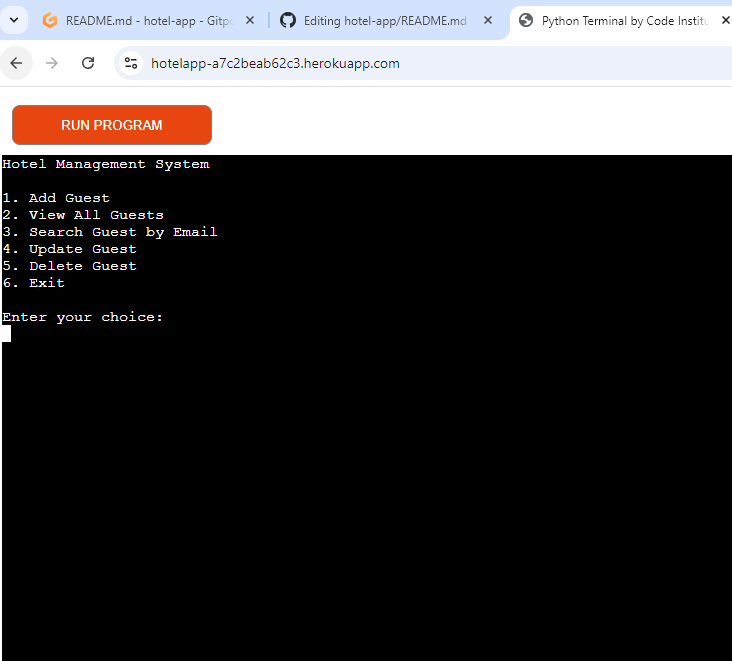

- **Add Guest**: Add a new guest and their information to the hotel’s database.  
  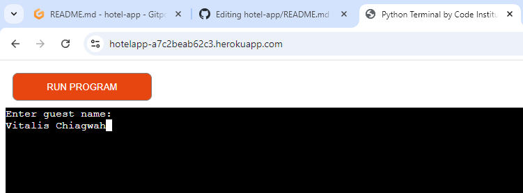 
  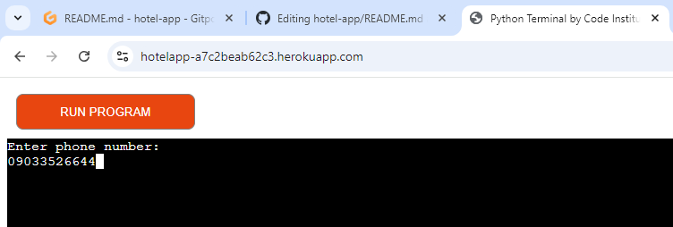
  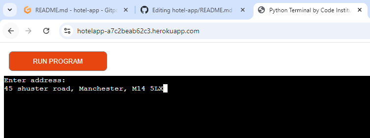 
  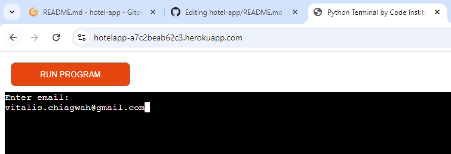
  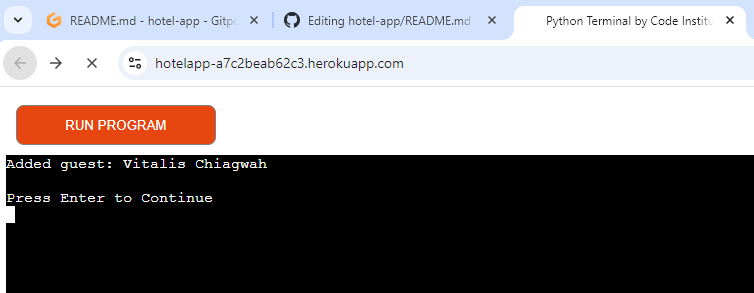 

- **View All Guests**: View a list of all the guests stored in the spreadsheet.  
  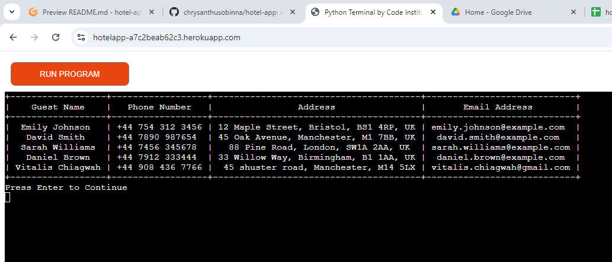

- **Search Guest by Email**: Search for guest details using their email address.  
  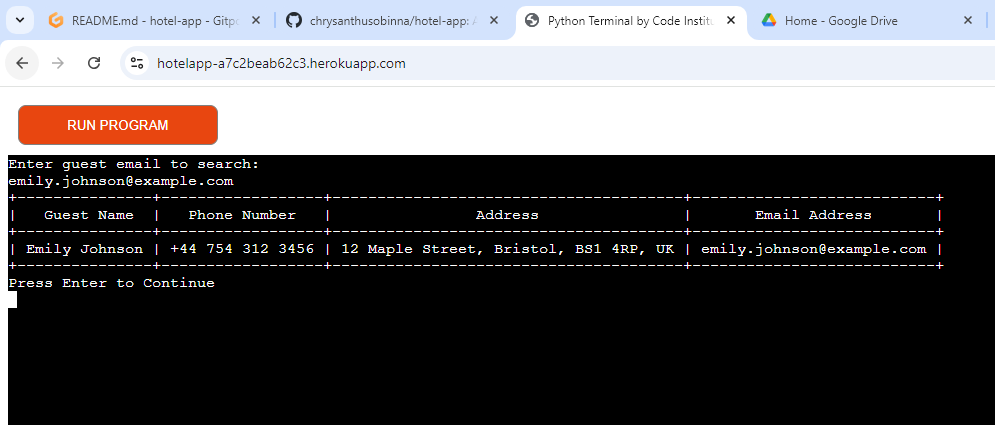

- **Update Guest**: Update specific guest details such as name, phone and address.  
  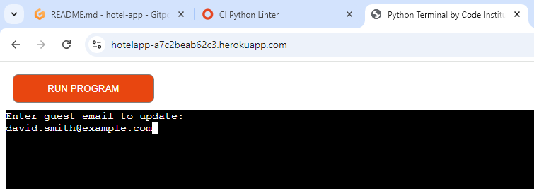 
  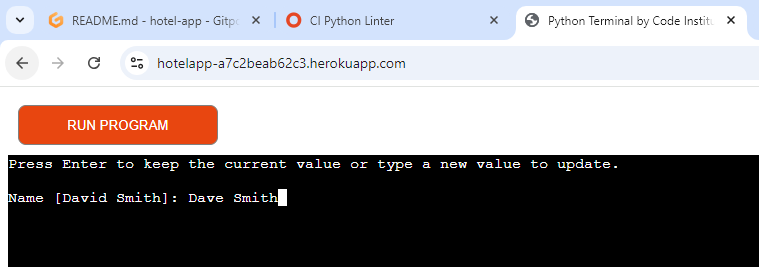 
   
  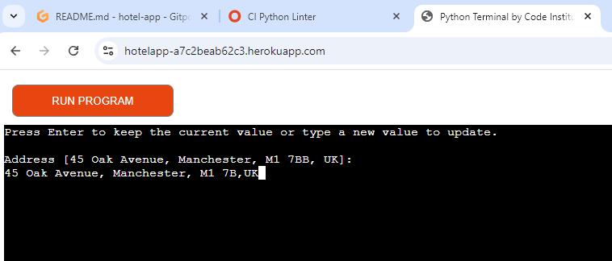 

- **Delete Guest**: Delete a guest’s record using their email.  
  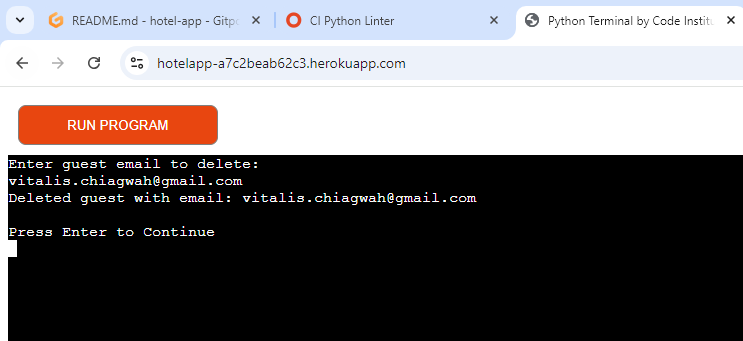


## Technologies Used

- **Python**: The core programming language used to develop the application.
- **Google Sheets API**: Used to interact with a Google Spreadsheet for storing and retrieving guest data.
- **Google Drive API**: Provides access to the Google Sheet stored in Google Drive.
- **PrettyTable**: A Python library used to display the guest information in a neatly formatted table in the command-line interface.
- **gspread**: A Python library to interact with Google Sheets.

---

## Setup Instructions

To run this project on your local machine, follow these steps:

### Prerequisites
1. **Python 3.x**: Ensure that you have Python installed on your computer.
2. **Google Cloud Credentials**: You need to enable the Google Sheets API and Google Drive API in your Google Cloud account and download the `creds.json` file (OAuth 2.0 credentials).
3. **Dependencies**: Install the required Python libraries using pip:

   ```bash
   pip3 install gspread
   pip3 install google-auth
   pip3 install prettytable
   ```

### Steps to Set Up
1. **Clone the Repository**:
   Clone this repository to your local machine.
   ```
   git clone https://github.com/chrysanthusobinna/hotel-app.git
   ```
2. **Set Up Google Cloud Credentials**:
   - Visit the [Google Developers Console](https://docs.google.com/spreadsheets/d/1MABIV-ix8CTtkvvS4BLH_S5YdTy7lRYCEz2r5IQKxjc/edit?usp=sharing).
   - Create a new project and enable the Google Sheets API and Google Drive API.
   - Create credentials and download the `creds.json` file.
   - Place the `creds.json` file in the project directory.
   
3. **Run the App**:
   Start the application by running the `run.py` file in the command line:
   ```
   python3 run.py
   ```

---

## Application Workflow

### 1. **Add Guest**:
   - Input guest details: name, phone number, address and email.
   - The app validates all inputs and checks for duplicate emails before adding the guest.

### 2. **View All Guests**:
   - Displays all guest records stored in the Google Sheet in a tabular format using PrettyTable.

### 3. **Search Guest by Email**:
   - Input the guest's email to retrieve and display their details.

### 4. **Update Guest**:
   - Input the guest’s email and update any of the fields (name, phone, etc.).

### 5. **Delete Guest**:
   - Input the guest’s email and delete their record from the database.

### 6. **Exit**:
   - Exit the application.

---

## Data Model

The app uses a Google Spreadsheet as the backend database. Each guest's data is stored in a row of the spreadsheet. The columns represent:

- Guest Name
- Phone Number
- Address
- Email Address


### Flowchart

The app's process is mapped out in a flowchart to visualize the flow of operations from the menu choices to CRUD functionalities. The flowchart can be found in the `documentation` folder.


#### 1. Flowchart for Updating Guest Record

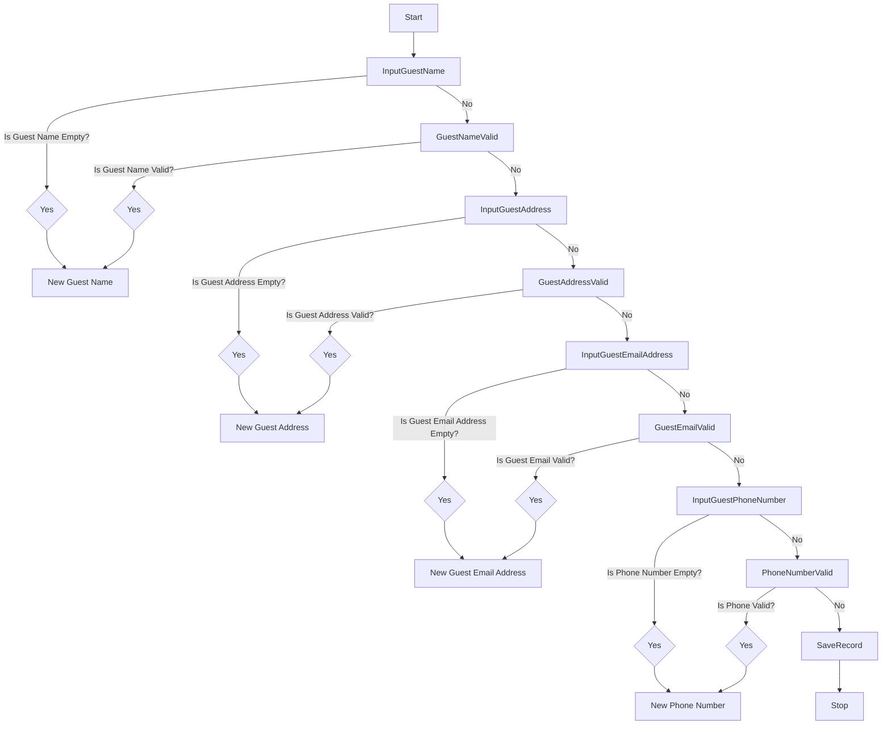

source: [Mermaid](https://mermaid.live/edit#pako:eNqNVdtu4jAU_JXIzxQ5F5ooD61WKqr6glZLVWl3w4OXuBCVxJHjtKWUf1_n5OJLgkSf6Mx4zjkzEpzQlqUUxej1wD62e8KF8_yQFI78W4vmv5ubO-epKGvxWNNKrEhOW9bEQPb9VDmAOAAt81Ic77-dQQTA6TetzpctVkx78EIOWdpqTRPQDtDf5WdWiazYadM31jOwmtoSiHt7qFxSW3TEWfNX9OO60c116uofacppVbVyO5KOtFbuUSPbDrwcr-E1JNyhdsi6m7qzQ-2oO3gzfj8VeL-Hkbmun4jdoscbqfCvWsasYJmT7DD0YOems9YpQE3XAdTlMsamQyNA2X0oO3U7YHYXxkob22Gqj_aF0YbSTnRhkPY2qoerFzG7-LlnBV3V-T_Kx1Vo5HAEYE4H9hVowssdjNyaTTRQ68D2Az2AKn99kc3omZl8q-0zt2Vm6BOsNr4J_OrJzYFr8k5_0S3jaZ-vQkC1FqxMCjRDOeWyqlT-LJwaYYLEnsovfhTLjynhbwlKirPUkVqw9bHYoljwms5QXaZE0IeM7DjJUfxKDpVES1Kg-IQ-Uey6_txf-G7gel6IbxcLb4aOKF6Ec4wjzw9DF_tR6IfnGfpiTDrgeYSDKLiNAoyxjwPPA7s_QLYzOat3-27W-T-5cVbZ)

#### 2. Flowchart for Deleting Guest Record
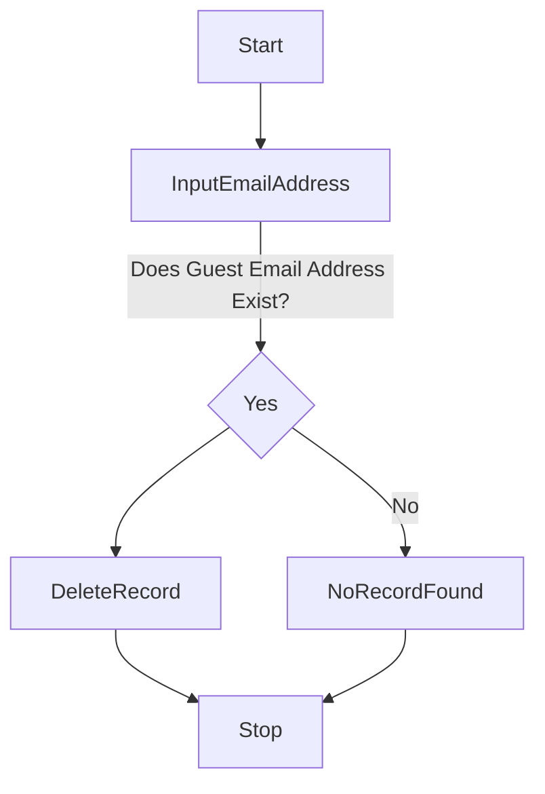

Source: [Mermaid](https://mermaid.live/edit#pako:eNp9kLtOwzAUQH_FunMa5VlHHkBIKYilA2UBZbHi24dI4sgP0ZLk33EdKpUi4en6nuMzeIBaCgQG20Z-1nuuDHktq464szHn22JxR5673ppVyw_NgxAKtZ6FP2svj6VETZ4sakM8JBe6Oh60uR9n5pHf6OEN9TQnb5EvltigwRespRL_aONajmQtZ-9R2u5Hvn7uxY2R_Yx-2VcMAmhRub5wPzOc3QrMHlusgLlRcPVRQdVNzuPWyM2pq4EZZTEA2wtusDzwneLtZdnzDtgAR2BxnIZpnsZZnCQ0WuZ5EsAJWE7DKCqSlNI4Sgua0imALyldIAqLKCuypYNJnLuJ-ty7h3NdSbvbA9vyRuP0DYI-lYk)

#### 3. Flowchart for Searching Guest Feature
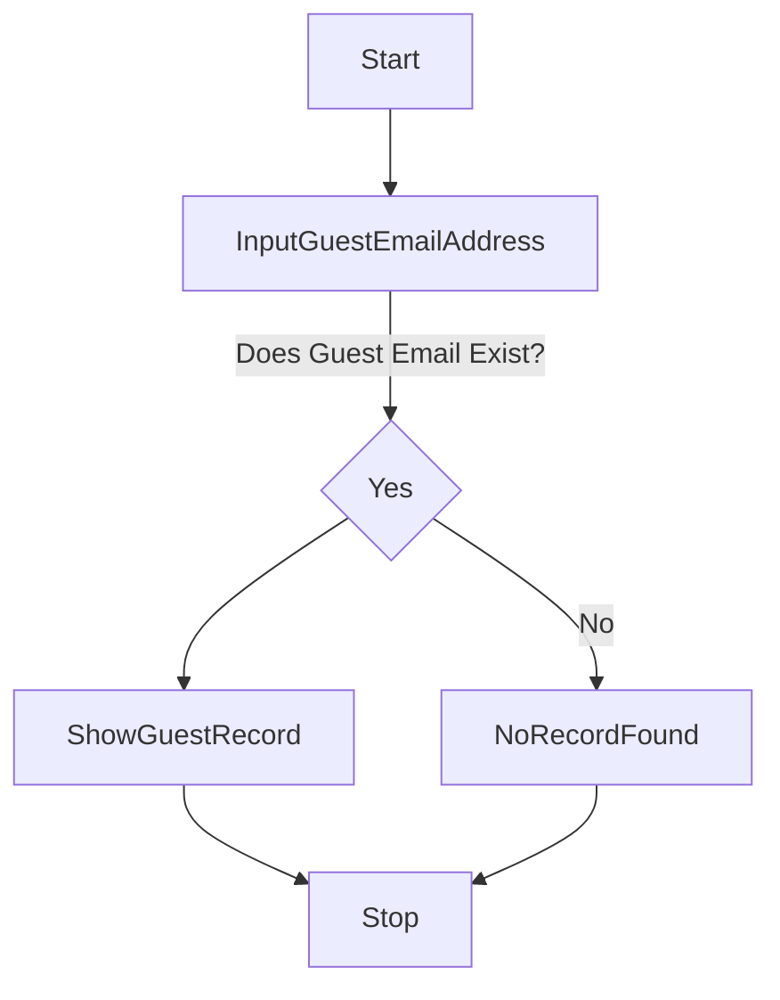

Source: [Mermaid](https://mermaid.live/edit#pako:eNp9kMtOwzAQRX_FmnUa5VlHXoCQWhCbLigbUDZW7DYRTSbyQ21J8u-4TiWgQng1nnPmjjQDVCgkMNgd8FjVXBnyuio74t7WXH6LxR157nprnqzUZt3y5vAghJJaz9bfzI-NK5SaeEY8JOtTo839SL5939HDm9TTnHeLfNK2xqMHL7JCJf4xxw2OZIOz94i2u8o3CXOqwX6mvwZ-MAiglcqtEO5Cw8UtwdSylSUwVwquPkoou8l53BrcnrsKmFFWBmB7wY1cNXyveAtsxw_adXveARvgBCyO0zDN0ziLk4RGyzxPAjgDy2kYRUWSUhpHaUFTOgXwiegSorCIsiJbOpjEuauoj3v3cN6p0O7r667pC5lomao)


#### 4. Flowchart for Viewing All Guest Records
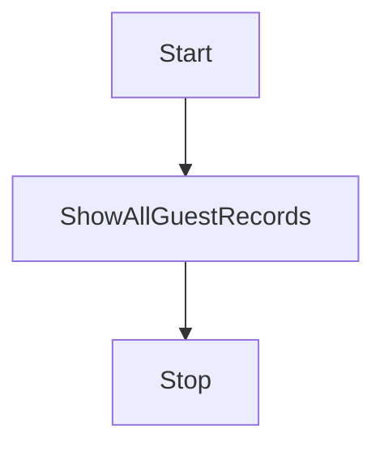

Source: [Mermaid](https://mermaid.live/edit#pako:eNplTbtugzAU_RV0Z4L8wDHyUKlSpO4lU-XFwk6IAr7I2EpSxL_XJNl6p3PPc4EOrQMFpwFvXW9CLI4H7Yt8bdy-3e6jaHu8fQ7DV3Jz_HYdBju_Lf-FVyDipD2UMLowmovN_cuW0BB7NzoNKkNrwlWD9mv2mRSxffgOVAzJlZAma6I7XMw5mBHUyQxzZifjQS1wB0Upr7jgtKaMSbIXgpXwACVkRUjDuJSU8EZyuZbwi5gbSNWQuqn3WWRUbOhZ9_MUX5sB07l_b61_Pb1WSg)


#### 5. Flowchart for New Guest Record Feature
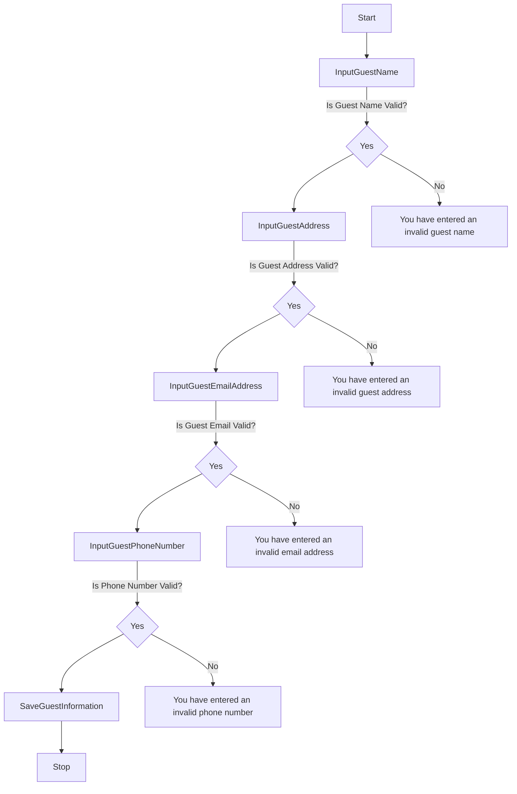

Source: [Mermaid](https://mermaid.live/edit#pako:eNqNk0tvgkAUhf_K5K7V8BAxLNo0sWncmCY2TWzpYipXIZUZMgy2FvzvHQZUxFdZDecczr0fgRzmPEDwYLHi3_OQCkleRj4j6prK8q7bvSNjlmTyKcNUTmiMlXus6VgxTolWiJZe6SoK7guyD2khn2G6rSqOjdakhyAQmKYXk8WEFyq-LoW9_e7DjGckpGskyCQKDAhlJKpiZKmXYyUDfPisDVKPbLHs1COcWjxL1PRaUI8xjVanZCdPnMDViX_x0br_HGJzgRanto4ptXSW8eC0CJ9DznCSxZ8oLsdP8LR_Aw71ftfgGrP3bFojtbiDawTbdG1LF03VSnrCmC24iKmMOLsSb-I1Ajf4Er0pq17dAe_c7GopyROfQQdiVHIUqH84Lx_xQYZYfuGeOgZUfPngs63K0Uzy6YbNwZMiww5kSUAljiK6FDTeiQll4OXwA55p2j3bsc2-aVmuMXAcqwMb8By3ZxhDy3Zd07CHru1uO_DLuSowekOjP-wPlGmZTnnSdW_arNoFz5YheAu6SnH7B_diiLI)


---

## Validation

- **Name**: Ensures the name contains only alphabetical characters and hyphens.
- **Phone Number**: Validates phone numbers using a regular expression.
- **Email**: Validates the email format and checks for duplicates.

---

## Dependencies

- `gspread`: For interacting with Google Sheets.
- `google-auth`: For handling authentication with Google APIs.
- `prettytable`: For displaying data in table format in the terminal.

---

## Media & Attribution

- [PrettyTable Documentation](https://pypi.org/project/PrettyTable/) was referenced for creating formatted tables in the terminal.
- [Google Sheets API Documentation](https://developers.google.com/sheets/api) was used to integrate the application with Google Sheets.
- [Google Drive API Documentation](https://developers.google.com/drive/api) was used to access the Google Sheets stored on Google Drive.

---

## Acknowledgements

- Thanks to my mentor Tim Nelson for their support throughout the development of this project.
- Special thanks to the **Code Institute** community for providing invaluable resources.
