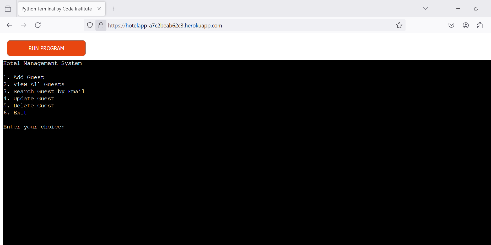
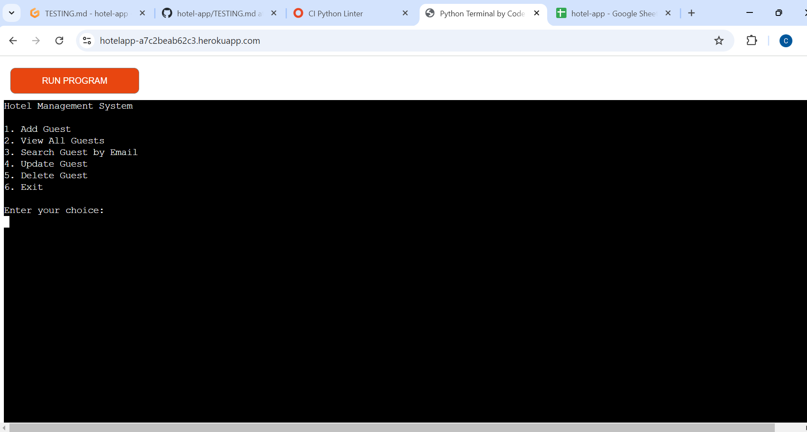
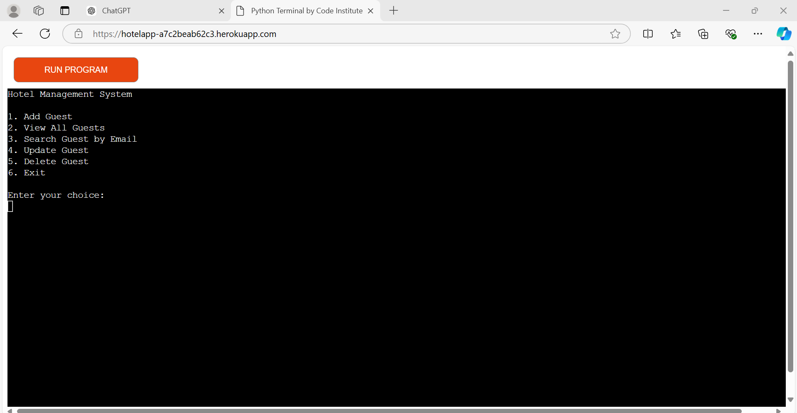
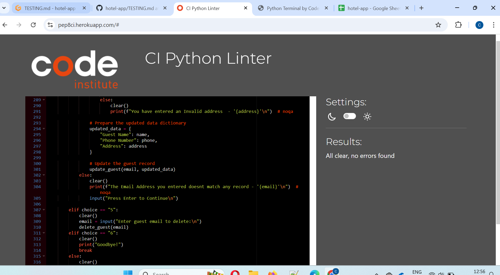

# Testing

> [!NOTE]  
> Return back to the [README.md](README.md) file.

## Feature-by-Feature Testing

This section details the testing conducted on each feature of the project to ensure everything works as intended and provides a seamless experience for users.

### Project Display

## User Experience Testing

- **Usability Testing**: Conducted user tests with several individuals who interacted with the site and provided feedback. 
  - **Issues Encountered**: Users found the interface incompatible with mobile devices.
  - **Resolution**: Recommended accessing the site on PC devices for an optimal experience.
 
## Compatibility Testing

### Browser Compatibility

Tested the deployed project on various browsers to ensure consistent performance. Below are screenshots from Firefox, Chrome, and Edge (align screenshots side by side):

  

### Device Compatibility

Ensured functionality across various devices. Since this is a command-line project running on Node.js, it is more compatible with PC devices than mobile phones.

## Regression Testing

After implementing fixes or updates, I ensured that previous features and functionalities still work as intended. This prevented new changes from breaking existing features.

## Documentation and Logs

Maintained detailed records of testing procedures, results, and any bugs encountered, along with their resolutions, demonstrating a systematic approach to testing.

## User Feedback Incorporation

Collected user feedback from friends and peers and implemented improvements to enhance the user experience, particularly in validation messages and overall interface design in the command line.

## Code Validation

To ensure correct input and input types, I manually tested the code. 

### Python

I used the recommended [PEP8 CI Python Linter](https://pep8ci.herokuapp.com) to validate all of my Python files. Below is a screenshot of the validation result:

## Defensive Programming

Defensive programming was employed to ensure the application handles incorrect inputs appropriately. This was also tested manually. Below is a screenshot demonstrating this:

## Bugs

No bugs were found during the testing process.
 